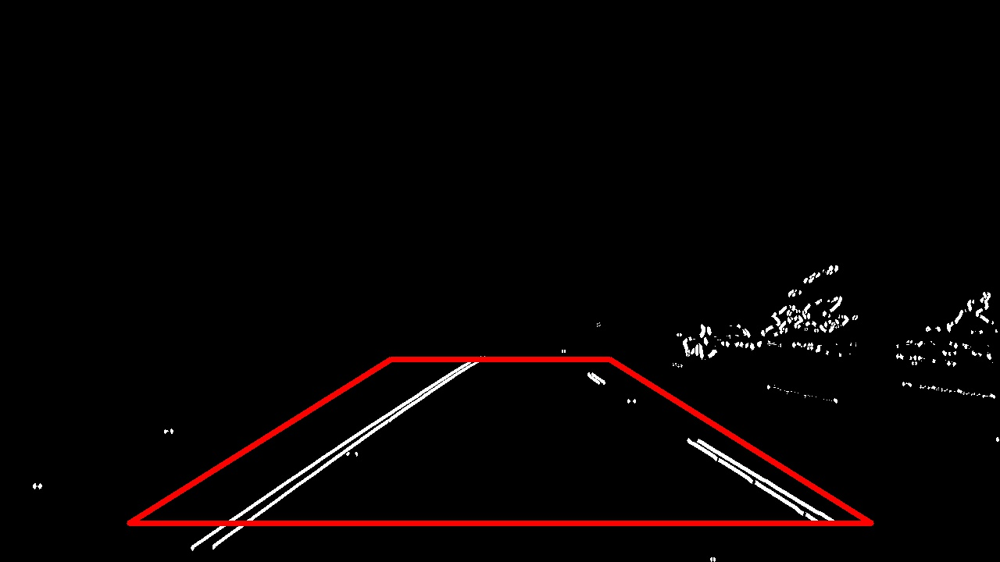
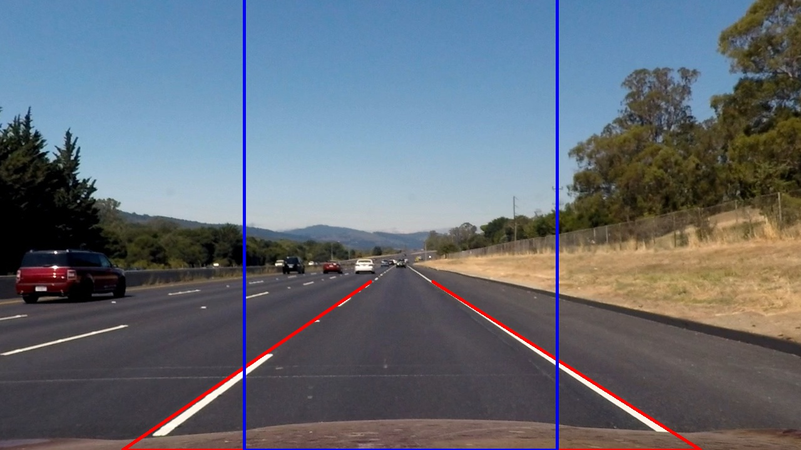

## Advanced Lane Finding
[](http://www.udacity.com/drive)


In this project, your goal is to write a software pipeline to identify the lane boundaries in a video.


The Project
---

The goals/steps of this project are the following:

* Compute the camera calibration matrix and distortion coefficients given a set of chessboard images.
* Apply a distortion correction to raw images.
* Use color transforms, gradients, etc., to create a thresholded binary image.
* Apply a perspective transform to rectify binary image ("birds-eye view").
* Detect lane pixels and fit to find the lane boundary.
* Determine the curvature of the lane and vehicle position with respect to center.
* Warp the detected lane boundaries back onto the original image.
* Output visual display of the lane boundaries and numerical estimation of lane curvature and vehicle position.
***
Note that all the notebooks need the helper functions script `0. Functions_Clases Pipeline.py` that is auto-generated by the notebook `0. Functions_Clases Pipeline.ipynb` when executed. All the requirements to run the notebooks should be in the `pickle_data` folder. This project uses pickle files wich is a way to pass data from notebook to notebook.
***
# 1. Camera calibration

The code for this section is contained in the Jupyter notebook `1. Camera Calibration Parameters.ipynb`.


The notebook starts by preparing the "object points", which will be the (x, y, z) coordinates of the chessboard corners in the world. 

An asumption is made that the board is fixed on the (x, y) plane at z=0, such that the object points are the same for each calibration image. Thus, objp is just a replicated array of coordinates, and objpoints will be appended with a copy of it every time it successfully detects all chessboard corners in a test image. imgpoints will be appended with the (x, y) pixel position of each of the corners in the image plane with each successful chessboard detection.

The objpoints and imgpoints were then used to compute the camera calibration and distortion coefficients using the `cv2.calibrateCamera() ` function. The chessboard size was set to 9x6 for the project. 


Distortion correction was then applied to test images using the `cv2.undistort()` function with the following results:

<table>
    <tr>
        <td>
            <p style="text-align: center;">Original image</p>
            
        </td>
        <td>
            <p style="text-align: center;">Undistorted image</p>
            
        </td>
    </tr>
</table>


## Notebook output:    
+ Calibration images with chessboard overdrawn
+ Undistorted calibration images with chessboard overdrawn
+ Pickle file with camera calibration parameters `camera_calibration_params.p`.
  
# 2. Image undistortion
The code for this section is contained in the Jupyter notebook `2. Image undistortion.ipynb`. 

It is possible to test that the undistortion is working by checking the closer images where it can be detected a flat line instead of a concave line at the bottom side of the paper. See the image below.

<table>
    <tr>
        <td>
            <p style="text-align: center;">Original image</p>
            
        </td>
        <td>
            <p style="text-align: center;">Undistorted image</p>
            
        </td>
    </tr>
</table>

As we can see in the images below, the differences are quite subtle, although present in every image. The further the pixels are from the center, the more distortion is appreciated. 

<table>
    <tr>
        <td>
            <p style="text-align: center;">Original image</p>
            
        </td>
        <td>
            <p style="text-align: center;">Undistorted image</p>
            
        </td>
    </tr>
</table>

## Notebook output:    
+ Undistorted test images
+ Pickle file with original test images `test_images.p`
+ Pickle file with undistorted test images `undistorted_images.p`

# 3. Color enhancement and filtering
The code for this section is contained in the Jupyter notebook `3. Color Enhancement.ipynb`. 

Firstly images/frames are converted to HSL and then filtered for white and yellow with the helper function `colorEnhancement(img)`

The mask filters for white and yellow are created by applying the following range filters:

```
# Yellow mask range
color1_hls = (70, 120, 110)
color2_hls = (100, 255, 255)

#White mask range
color1_hls_w = (0, 220, 0)
color2_hls_w = (180, 255, 255)
```

Finally, bitwise operations are performed in order to extract pixels present in any of both masks.

Then the image is converted from HSL to grayscale and a gaussian blur operation with a kernel of 5x5  is performed over the images. The results are presented below.

<table>
    <tr>
        <td>
            <p style="text-align: center;">HSL filtering</p>
            
        </td>
        <td>
            <p style="text-align: center;">Gray scale + Gaussian smoothing</p>
            
        </td>
    </tr>
</table>


## Notebook output:    
+ Binary images ready for edge detection `gauss_images.p`
+ HLS filtered images
+ Gauss smoothed grayscale images


# 4. Edge detection
The code for this section is contained in the Jupyter notebook `4. Edge detection.ipynb`. 

The output of the gaussias smoothing passes then over a custom made sobel edge detector `sobel_thresh(img, sobel_kernel=3, x_thresh=[1,255], y_thresh=[1,255], mag_thresh=[1,255], dir_thresh=[-np.pi/2, np.pi/2])
`

The Sobel operators uses a fixed **sobel kernel of size 3** for our project, which means that we will be using 3x3 matrices when applying the operator.


The detector function applies four techniques for edge detection. It calculates the gradient along the x axis (values increasing from left to tight, edges closes to the vertical), the y axis (values increasing from top to bottom, horizontal lines), then the Sobelx and the Sobely are combined into a third magnitude operator and a direction operator. Range values of minimum and maximum can be applied to each operator.

The result is obtained in the following form after applying the indicated thresholds: `result = (sobelx and sobely) or (sobelmag and sobeldir)`. The limits of each threshold are stated in the function as default values.

The results are aceptable, as we can see the lines ar thicker and better defined, although the noise got also increased:

<table>
    <tr>
        <td>
            <p style="text-align: center;">W/O Threshold</p>
            
        </td>
        <td>
            <p style="text-align: center;">Custom Sobel threshold</p>
            
        </td>
    </tr>
</table>


Note that the images were converted to 8bit integers in order to work with a standardized integer format.

## Notebook output:    
+ Images with sobel filter applied
+ Binary images with relevant features `edge_images.p`


# 5. Region of interest masking
The code for this section is contained in the Jupyter notebook `5. Region of interest.ipynb`. 

A region of interest binary mask filter is applied in an attempt to remove irrelevant features for line detection. A four side polygon is employed and it can be parametrized with the following hyperparameters:

```
# HYPERPARAMETERS

ROI_upperWidth = 300  #Width of the upper horizontal straight line in px
ROI_upperHeight = 300 #Height of the upper horizontal straight line from the bottom of the image in px
ROI_lowerWidth = 950  #Width of the lower horizontal straight line in px
ROI_lowerHeight = 50  #Height of the lower horizontal straight line from the bottom of the image in px    
```

<table>
    <tr>
        <td>
            <p style="text-align: center;">From sobel filter</p>
            
        </td>
        <td>
            <p style="text-align: center;">ROI filtered</p>
            
        </td>
    </tr>
</table>

## Notebook output:    
+ ROI filtered images
+ Binary images with relevant features `roi_images.p`

# 6. Perspective transform (birds-eye)
The code for this section is contained in the Jupyter notebook `6. Perspective transform.ipynb`. 

Once the relevant features are isolated, a perspective transform is employed in order to straighten out the lines. 

The magic takes place inside the `warp_image(img, hwidth = 250 ,offset = 0, height = -0, 
                                    overplotLinesDst=False, overplotLinesSrc= False )` function.

Within the previous function the method `cv2.getPerspectiveTransform(src, dst)` gets called with the source and destination points from where the transform matrix M is obtained. This matrix is then feed into the `cv2.warpPerspective()` function that `warps` the image. 


The source and destination points selected are presented below (Source points plotted in red and destination points plotted in blue):

```
# Source
dotS_UL=[592,450]; dotS_UR= [691,450]
dotS_LL=[195,720] ; dotS_LR= [1120,720]

# Destination
hwidth = 250
offset = -0
height = -800

dotD_UL=[offset+(1280//2)-hwidth,height]; dotD_UR= [offset+(1280//2)+hwidth,height]
dotD_LL=[offset+(1280//2)-hwidth,720] ; dotD_LR= [offset+(1280//2)+hwidth,720]
```


<table>
    <tr>
        <td>
            <p style="text-align: center;">Original with planes defined</p>
            
        </td>
        <td>
            <p style="text-align: center;">perspective transform</p>
            
        </td>
    </tr>
</table>

The results are generally good and the straights project fairly straight onto the birds eye perspective, which will help later on curvature detection. 

<table>
    <tr>
        <td>
            <p style="text-align: center;">Undistorted iamges warped</p>
            
        </td>
        <td>
            <p style="text-align: center;">ROI images warped</p>
            
        </td>
    </tr>
</table>

 Be careful to save the M and Minv matrices in order to `unwarp` the image later on.

Note that the destination lines go above the upper limit of the projected image, which is a technique used to amplify the lines to make the polynomial fit easier.

## Notebook output:    
+ Warped images of ROI pictures
+ Warped images of undistorted frames
+ Binary images with relevant features and perspective transform matrices `pickle_data/warped_images_params.p`.

# 7. Finding lines
The code for this section is contained in the Jupyter notebook `7. Finding Lines.ipynb`. 

First of all, a `Line` class is created (source code in `Line.py`). This line class contains different methods and properties that store everything related to the detection of the lines. Throughout the documentation, all of its methods and properties associated will be explained.

***
### `find_lane_x_points(warped_image) `
To begin with a histogram-based function is used to find the starting point of the lines. The function basically slits the image in half and uses the bottom half to do the histogram.

```
histogram = np.sum(binary_warped[binary_warped.shape[0]//2:,:], axis=0)
```

Then splits the image in two again but in this case in the horizontal axis, and detects the right and left peaks of the histogram wich results in the base X points used by the following functions.

```
    midpoint = int(histogram.shape[0]//2)
    leftx_base = np.argmax(histogram[:midpoint])
    rightx_base = np.argmax(histogram[midpoint:]) + midpoint
```

The Line method associated with this function is `lineLeft.updateXbase(leftx_base)` that checks if the value is below a threshold in comparison with the previous x point, if it meets the requirements is then appended to the array `Line.recent_xfitted` from wich, a moving average is employed to obtain the x value that gets recorded in the `Line.bestx` property.


```
    def updateXbase(self, currentx, limit=50, movingAvg = 10 ):
        """Updates the bestx with the given currentx
        if the difference is below a threshold gets appeded
        othewise discarded
        """
         # Not First iteration
        if np.any((self.recent_xfitted != 0)):
            # Check for outliers
            if (abs(currentx - self.bestx) < limit):
                self.currentx = currentx
            else:
                self.currentx = self.bestx
            
            # Apply moving average
            x = np.append(self.recent_xfitted, [self.currentx])
            self.bestx = moving_average(x, movingAvg)[-1]
        
        
        else:
            # First iteration
            self.currentx = currentx
            self.bestx = currentx
            self.recent_xfitted = currentx
            
        self.recent_xfitted = np.append(self.recent_xfitted, self.bestx) 
```


As the moving average is critical throughout the project, here below is its code. It is optimized so it computes the average taking into consideration the number of values contained in the array.

```
def moving_average(x, w):
    vectLen = len(x)
    if vectLen > w:
        sol = np.convolve(x, np.ones(w), 'valid') / w
    else:
        sol = sol = np.convolve(x, np.ones(vectLen), 'valid') / vectLen
    return sol
```

Note that this approach has numerous limitations, as it only takes into consideration a quarter of the image to obtain the values so uncentered cameras and tight bends can throw off the whole lane detection mechanism.

***
### `find_lane_pixels()`


This is one of the core functions of the line detection algorithm, it uses a sliding window search approach to find the lane pixels.
It basically uses the filtered point obtained by `find_lane_x_points(warped_image)` and uses it a start middle point at the bottom of the image, then creates a box with the hyperparameters stated below and it climbs up the image detecting the pixels.

```
# HYPERPARAMETERS
# Choose the number of sliding windows
nwindows = 8
# Set the width of the windows +/- margin
margin = 120
# Set minimum number of pixels found to recenter window
minpix = 40
```

A tweak was implemented in order to help the polynomial fitting functions to pass through the initial x point. Constrained optimization methods could be the "right" solution to the problem but they are expensive computationally so a simple solution is presented instead. The solution proposed is quite simple, the bottom and first sliding window gets filled with fake line pixels so it helps the polynomial to pass through it. The results can be seen in the images below.

<table>
    <tr>
        <td>
            <p style="text-align: center;">Sliding window method for lane pixel find</p>
            
        </td>
    </tr>
</table>


***
### `fit_polynomial()`
Now comes the tricky part. This function attempts to fit a sensible second-order polynomial to the detected line pixels. The main function is `np.polyfit(yPixels, xPixels, 2)` that computes the optimum second-order ploynomial that fits all points. As we stated below, the first square contains extra points to force the fitting and avoid miss detections. It is quite crude but it generally gives goods results overall.


<table>
    <tr>
        <td>
            <p style="text-align: center;">Sliding window method for lane pixel find</p>
            
        </td>
    </tr>
</table>


The `Line` method associated to the coefficients finding is `Line.updateCoeffsLine(...)`. It is a quite complex method. First detects if there have been previous detections, if not it inicialices the `Line.poly_best_fit` property that contains the current best coefficients in use and `Line.recent_poly_fits` that contains an array with the previously used coefficients. If the line is detected then it gets checked in case the coefficients differ more than the threshold `coefLimits=[1,1,10]` so it gets automatically rejected. If it is a good detection a moving average filter is then applied to each coefficient and stored as best fit which will be used for the calculation of the polynomial of this iteration then.

Its implementation is stated below.
```
def updateCoeffsLine(self,detected, current_fit, left_fitx, ploty, coefLimits=[1,1,10], movingAvg=5 ):
        """Updates the line polynomial equation coefficients
        for the current removing outliers and applying moving average filters
        to coeffs
        """
        # Not First iteration
        if  np.any((self.recent_poly_fits != 0)):
            if detected:
                self.detected = True
                if any(current_fit): 
                    self.poly_diffs = np.subtract(self.poly_best_fit,current_fit)
                    self.all_poly_diffs = np.vstack((self.all_poly_diffs,self.poly_diffs)) 
                # If outlier
                if (abs(self.poly_diffs[0]) > coefLimits[0] or abs(self.poly_diffs[1]) > coefLimits[1] or abs(self.poly_diffs[2]) > coefLimits[2] ):
                    print("missdetection")
                    print(self.poly_diffs)
                    self.detected = False
                    self.missdetections += 1 
                
                else:# If not outlier (Good detection)
                    self.detected = True
                    self.missdetections = 0 
                    # Mean average filter coefs                    
                    x = np.vstack((self.recent_poly_fits,current_fit)) 
                    c0 = moving_average(x[:,0], movingAvg)[-1]
                    c1 = moving_average(x[:,1], movingAvg)[-1]
                    c2 = moving_average(x[:,2], movingAvg)[-1]
                    self.poly_best_fit = np.array([c0,c1,c2]) 
                    self.recent_poly_fits = np.vstack((self.recent_poly_fits,self.poly_best_fit)) 
                    #print(self.recent_poly_fits)               
                    self.poly_plotx = np.polyval(self.poly_best_fit, self.poly_ploty)
                    
            else: #Not detected
                self.detected = False
                self.missdetections += 1 
        
        # First iteration
        else:
            self.poly_best_fit = current_fit
            self.recent_poly_fits = np.array([current_fit])

            self.poly_plotx = left_fitx
            self.poly_ploty = ploty
        
        self.measure_real_curvature()
```


***
### `search_around_poly()`
In order to speed up detection on videos another method was developed for line pixel detection. It basically creates a search area around the last polynomial fit. The function is controlled by a hyperparameter `margin` that determines the width to each side where to search for pixels. Implementation below.

```
def search_around_poly(binary_warped, lineLane):
    # Create an output image to draw on and visualize the result
    if len(binary_warped.shape) < 3:
        out_img = np.dstack((binary_warped, binary_warped, binary_warped))
    else:
        out_img = binary_warped
    
    # Width of the margin around the previous polynomial to search
    margin = 100
        
    # Grab activated pixels
    nonzero = binary_warped.nonzero()
    nonzeroy = np.array(nonzero[0])
    nonzerox = np.array(nonzero[1])
    
    
    lane_inds = ((nonzerox > (lineLane.poly_best_fit[0]*(nonzeroy**2) + lineLane.poly_best_fit[1]*nonzeroy + 
                lineLane.poly_best_fit[2] - margin)) & (nonzerox < (lineLane.poly_best_fit[0]*(nonzeroy**2) + 
                lineLane.poly_best_fit[1]*nonzeroy + lineLane.poly_best_fit[2] + margin)))
    
    leftx = nonzerox[lane_inds]
    lefty = nonzeroy[lane_inds] 
    
    # minimum number of pixels detected
    if len(leftx) < 20 or len(leftx) < 20: 
        lineDetected = False
        print("NO pixels with search around poly")
        coeffs_fit = [0,0,0]
        line_fitx = []
        return leftx,lefty, coeffs_fit, lineDetected, line_fitx, out_img
    else:
        lineDetected = True
        
    coeffs_fit = np.polyfit(lefty, leftx, 2)
    line_fitx = np.polyval(coeffs_fit, lineLane.poly_ploty)  # evaluate the polynomial   
    
    
        
    out_img[lefty, leftx] = [255, 0, 0]
    
    return leftx,lefty, coeffs_fit, lineDetected, line_fitx, out_img
```


## Notebook output:    
+ Lines isntances for right and left lines of the different processed images `pickle_data/lines_lane.p`.

# 8. Image unwarping
The code for this section is contained in the Jupyter notebook `8. Unwarp Images.ipynb`. 

Once the lines have been found and the second-order polynomial is fitted to ,  then the images get unwarped to their original shape. The function `cv2.warpPerspective(...)` is used again to unwrap the images with the projection matrices stored from the step number 6.


<table>
    <tr>
        <td>
            <p style="text-align: center;">Undistoreted images with lines overdrawn</p>
            
        </td>
    </tr>
</table>


## Notebook output: 
+ Unwarped images with fitted lines   
+ Unwarped images with lines drawn `result_Images.p`.

# 9. Curvature radius and vehicle position
The code for this section is contained in the Jupyter notebook `9. Anotate Images.ipynb`. 

<table>
    <tr>
        <td>
            <p style="text-align: center;">Undistoreted images with lines overdrawn</p>
            
        </td>
    </tr>
</table>

The formula below is used to calculate curvature. It is not very accurate in our case but it is understood that the implementation is correct. The `ym_per_pix = 30/720 # meters per pixel in y dimension` hyperparameter can be modified to change the pixel/meter ration, note that the formula is optimized to take into considerations amplifications done during the perspective transform.

<p style="text-align: center;">

</p>


```
def measure_real_curvature(self, amplif = 800):
    '''
    Calculates the curvature of polynomial functions in meters.
    '''
    # Define conversions in x and y from pixels space to meters
    my = 30/(720 + amplif) # meters per pixel in y dimension
    mx = 3.7/700 # meters per pixel in x dimension

    # Define y-value where we want radius of curvature
    # We'll choose the maximum y-value, corresponding to the bottom of the image
    y_eval = np.max(self.poly_ploty)

    a =self.poly_best_fit[0] * (my**2/ mx)
    b =self.poly_best_fit[1] *(my/mx)

    ##### Implement the calculation of R_curve (radius of curvature) #####
    res = ((1 + (2*a*y_eval + b)**2)**1.5) / np.absolute(2*a/my)
    self.radius_of_curvature = res
```

For the vehicle position the algorithm is quite straightforward, it only checks the difference between both x stating points of left and right planes and computes the diference from the center of the image and finally converts the pixel result to meters. An extra ratio is included to account for the image amplification when performing the perspective transformation.


```
frameCenter = np.mean([lineLeft.bestx,lineRight.bestx] , dtype=np.int32)
imgCenter = img.shape[1]//2
dev = frameCenter - imgCenter
xm_per_pix = 3.7/450 # meters per pixel in x dimension
result = dev*xm_per_pix
```
## Notebook output:    
+ Annotated images
***
# 10. Video pipeline
The code for this section is contained in the Jupyter notebook `10. Videos Pipeline.ipynb`. 

The result videos (`./output_videos/`) are quite pleasing, although improvements can be made. 


<table>
    <tr>
        <td>
            <p style="text-align: center;">Project video</p>
            
        </td>
        <td>
            <p style="text-align: center;">Challenge video</p>
            
        </td>
    </tr>
</table>


## Summary Video Pipeline

* Resize images to 1920x720
* Apply a distortion correction to raw images.
* Apply HSL yellow and white mask
* Convert to grayscale
* Smooth with gauss filtering
* Apply Sobel based edge detection
* Apply Region of Interest mask
* Warp the image to obtain a "birds-eye" perspective
* Find lane x points using histogram peaks
    * Update Line instances with X points (outliers deletion + moving average)
* Check for miss detections
    * Missdetections --> Apply sliding window search
    * NO Missdetections --> Apply polynomial search
    * Update Line instances with polynomials (outliers deletion + moving average)
* Sanity Check:
    * Line detection from polynomials
    * Separation between lanes
    * Reset Line parameters on multiple miss detections
* Create image with lines to overdraw    
* Unwarp lines from "birds-eye" to original perspective
* Warp the detected lane boundaries back onto the original image.
* Compute and annotate Radius of curvature
* Compute and annotate vehicle position on lane
* Output visual display of the lane boundaries and numerical estimation of lane curvature and vehicle position.

In an attempt to create a better output multiple checks were included, here below is an example when multiple miss detections (causing by the lane not having the right width or the polynomial is changing too much or even when is not possible to find line pixels due to excessive image filtering). 

It can be seen on the video when the pipeline switches between poly fit and the sliding window method, the pixel highlight was left on purpose to appreciate this phenomenon.

```
def sanityCheck(self,limit):
    '''
    Resets the line if it has multiple missdetections.
    '''
    if self.missdetections > limit:
        self.recent_poly_fits = self.recent_poly_fits[:-(limit-1),:]
        self.recent_xfitted = self.recent_xfitted[-(limit-1)]
        self.missdetections = 0
        print("Reset by SanityCheck")
```
The harder challenge was attempted but a good fine tuning parameter was required so the output is ok but not great. A good amount of effort is required to generalize this pipeline, for that is believed that other methods as deep learning could be more suitable for the task at hand.

## Notebook output:    
+ Annotated videos with detected line lanes overdrawn

# 11. Profiling Video pipeline
The code for this section is contained in the Jupyter notebook `11. Profiling Videos Pipeline.ipynb`. 

This pipeline is quite slow for processing images, a maximum average of 5it/s can be obtained with an average computer. So, this is no adequate for real-time processing, for that we would need optimized code written in languages as c++ or take advantage of parallelization which is out of the scope of this project.

It is possible to check that the differences in execution employing the coefficient approximation method rather than the sliding window results in `0.027 s/frame` improvement. It seems not a lot but it reduces between 30-60 seconds the videos processed.  

```
resizeImage took 0.0 seconds!
undistorted took 0.023970365524291992 seconds!
colorEnhancement took 0.009995222091674805 seconds!
grayscale took 0.0009992122650146484 seconds!
gaussian_blur took 0.00099945068359375 seconds!
sobel_thresh took 0.0997314453125 seconds!
region_of_interest took 0.0 seconds!
warp_image took 0.0 seconds!
###
find_lane_pixels took 0.027791738510131836 seconds!
Search blindly image 0.012993335723876953 seconds!
###
Draw the lane 0.005997180938720703 seconds!
Radius of curvature 0.001998424530029297 seconds!
Vehicle position 0.0019989013671875 seconds!

```

```
resizeImage took 0.0 seconds!
undistorted took 0.02999281883239746 seconds!
colorEnhancement took 0.009887933731079102 seconds!
grayscale took 0.0019969940185546875 seconds!
gaussian_blur took 0.0009965896606445312 seconds!
sobel_thresh took 0.10873818397521973 seconds!
region_of_interest took 0.0 seconds!
warp_image took 0.0 seconds!
####
Search based on coefs 0.01322031021118164 seconds!
####
Draw the lane 0.005995988845825195 seconds!
Radius of curvature 0.001993894577026367 seconds!
Vehicle position 0.0010023117065429688 seconds!
```

# Shortcomings and improvements of the project
+ More work is needed on the sanity check algorithm (keep projection until good values found)
+ Search based on screen position that might be affected by camera position and tight bends
+ Possible to include Kalman filter for lane position and shape
+ Not suitable for real-time 
    + Optimize code by parallelizing
    + Port to c++
+ Include logging capabilities
+ Apply smoothing between frames so lines can be detected easier as they fade with each other in-between frames.
+ Differentiate between bad frames (no pixels) and bad polynomial fits when doinf sanity checks.
+ Discard/accept polynomial fit by curvature of previous fits
****

# End of the project